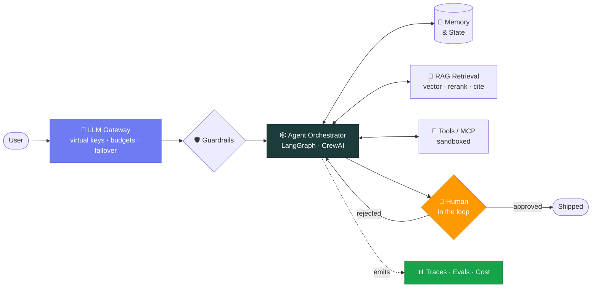

### Aniket Wagh

**Most AI demos die on the way to production. I build the part that survives the trip.**

---

## The stack I actually ship

Anyone can wire an LLM to a prompt. The interesting engineering is everything *around* it — the layer that makes an enterprise willing to put it in front of real users:

🔭 Currently building **[GarudaSDLC](https://github.com/aniketwaghh/GarudaSDLC)** and **[rag-studio](https://github.com/aniketwaghh/rag-studio)** &nbsp;·&nbsp; 🌱 contributing to the Python agent ecosystem &nbsp;·&nbsp; 💬 ask me about **making agents observable, governed and multi-tenant**

---

## What I'm building

<table>
<tr><th align="left">Repo</th><th align="left">What it does</th><th align="left">Stack</th></tr>
<tr>
  <td><a href="https://github.com/aniketwaghh/GarudaSDLC"><b>GarudaSDLC</b></a></td>
  <td>AI "employees" that turn client meetings into shipped software. A silent bot joins the call, builds a searchable knowledge graph, drafts Jira tickets and runs impact analysis — humans approve everything, and every decision traces back to a video timestamp.</td>
  <td>Python · Agents · Pinecone · AWS</td>
</tr>
<tr>
  <td><a href="https://github.com/aniketwaghh/rag-studio"><b>rag-studio</b></a></td>
  <td>A visual builder for production RAG pipelines. <code>uv</code> workspace split into API and worker services, Turborepo React frontend, Kubernetes deployment path.</td>
  <td>FastAPI · TypeScript · K8s</td>
</tr>
<tr>
  <td><a href="https://github.com/aniketwaghh/sahayog-ai"><b>sahayog-ai</b></a></td>
  <td>SahayogAI product site — React + Vite with a Node backend, i18n, analytics and an Nginx deployment path.</td>
  <td>React · Vite · Node</td>
</tr>
<tr>
  <td><a href="https://github.com/aniketwaghh/blockbuy-marketplace"><b>blockbuy-marketplace</b></a></td>
  <td>Blockchain-powered marketplace — Flutter client backed by Ethereum smart contracts.</td>
  <td>Flutter · Solidity · Web3</td>
</tr>
</table>

---

## Open source

| Project | Contribution | |
| :-- | :-- | :-- |
| **[Chainlit](https://github.com/Chainlit/chainlit)** | [`feat(mcp): support mcp 2.x alongside 1.x`](https://github.com/Chainlit/chainlit/pull/3030) — introspected both MCP SDK majors directly, corrected two wrong assumptions in the tracking issue, and landed **one code path serving both** with no version sniffing | 🟢 Open |
| **[kana-dojo](https://github.com/lingdojo/kana-dojo)** | Content contribution to the Japanese-learning platform | ✅ Merged |

---

## Toolkit

<b>🎓 Credentials & recognition</b> — <i>click to expand</i>

 

| | |
| :-- | :-- |
| 🏅 **AWS Certified Developer – Associate** (DVA-C02) | Amazon Web Services |
| 📜 **AI Engineer — Core Track** | LLM engineering, RAG, LoRA/QLoRA fine-tuning, evals, observability |
| 📜 **AI Engineer — Agentic Track** | Agentic design patterns, context engineering, MCP, CrewAI, LangGraph |
| 🏆 **AI Fiesta — Certificate of Appreciation** | Apexon — for driving AI adoption across teams |
| 🌟 **Budding Star Award, Q4** | Apexon — for exceptional performance and rapid learning |
| 🎓 **B.Tech, Computer Science & Engineering (AI)** | NCER Pune · 2024 · CGPA 8.28/10 |

---

## By the numbers

<!-- Generated by a GitHub Action into this repo, so these never break when a
     third-party rendering service goes down or gets rate limited. -->

<picture>
  <source media="(prefers-color-scheme: dark)" srcset="https://raw.githubusercontent.com/aniketwaghh/aniketwaghh/output/github-snake-dark.svg" />
  <source media="(prefers-color-scheme: light)" srcset="https://raw.githubusercontent.com/aniketwaghh/aniketwaghh/output/github-snake.svg" />
  
</picture>

<i>more charts</i>

 

---

### Let's build something that actually ships

Open to talking **agentic AI platforms**, **LLM infrastructure** and **open-source collaboration**.

Stat cards are generated in-repo by GitHub Actions — no third-party uptime required.

