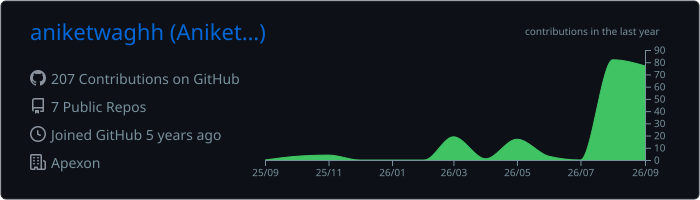
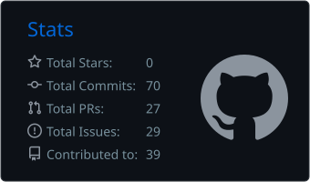
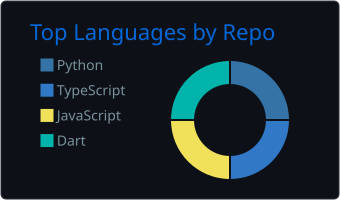
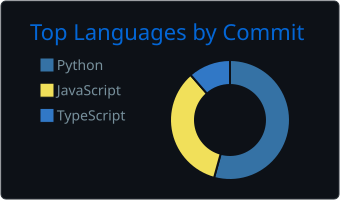
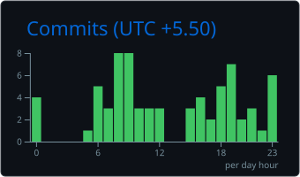

### Aniket Wagh

**Most AI demos die on the way to production. I build the part that survives the trip.**

---

## About

AI Software Engineer in Pune, shipping production agentic AI end to end — multi-agent platforms,
LLM gateways, RAG at scale and voice agents, with guardrails and observability built in from day one.

I find and fix bugs upstream in the tools I build on. Currently building
**[rag-studio](https://github.com/aniketwaghh/rag-studio)**, a visual builder for production RAG
pipelines, and **[GarudaSDLC](https://github.com/aniketwaghh/GarudaSDLC)**.

---

## Open source

### Merged

| Project | What it is | Fix |
| :-- | :-- | :-- |
|  **[browser-use](https://github.com/browser-use/browser-use)** `★112k` | Browser automation for AI agents | [Agent navigation silently dropped valid URLs](https://github.com/browser-use/browser-use/pull/5576) · [Gemini chats lost the first user message](https://github.com/browser-use/browser-use/pull/5597) |
|  **[DeerFlow](https://github.com/bytedance/deer-flow)** `★81k` | ByteDance's long-horizon agent harness | [A broken dependency blocked every fresh setup](https://github.com/bytedance/deer-flow/pull/5087) |
|  **[docling](https://github.com/docling-project/docling)** `★66k` | Document parsing for gen-AI pipelines | [Corrupted headers in parsed CSV output](https://github.com/docling-project/docling/pull/4098) · [Encoded files produced invalid WebVTT and lost the first heading](https://github.com/docling-project/docling/pull/4109) |
|  **[LiveKit Agents](https://github.com/livekit/agents)** `★14k` | Realtime voice AI agent framework | [API keys leaked into logs](https://github.com/livekit/agents/pull/7032) |

<!-- In review — un-comment to show. Kept here so the list survives edits.
     Note: the alignment row uses `:-` not `:--`, because a literal `--`
     inside an HTML comment is invalid and can end the comment early.

### In review

| Project | Fix |
| :- | :- |
|  **[n8n](https://github.com/n8n-io/n8n)** `★203k` | [Fields named `toString` or `valueOf` returned JS internals, not data](https://github.com/n8n-io/n8n/pull/37359) |
|  **[LiteLLM](https://github.com/BerriAI/litellm)** `★57k` | [Chained gateways exposed no usable model list](https://github.com/BerriAI/litellm/pull/38557) |
|  **[LlamaIndex](https://github.com/run-llama/llama_index)** `★52k` | [Text splitter breached its own chunk limit](https://github.com/run-llama/llama_index/pull/22859) |
|  **[Mastra](https://github.com/mastra-ai/mastra)** `★28k` | [Memory timestamps wrong outside UTC servers](https://github.com/mastra-ai/mastra/pull/22590) |
|  **[Chainlit](https://github.com/Chainlit/chainlit)** `★12k` | [Unblocked the MCP 2.x upgrade](https://github.com/Chainlit/chainlit/pull/3030) |
|  **[OpenLIT](https://github.com/openlit/openlit)** `★3k` | [Guardrails silently skipped on async calls](https://github.com/openlit/openlit/pull/1496) |
|  **[OpenHands SDK](https://github.com/OpenHands/software-agent-sdk)** `★1k` | [Concurrent tool calls corrupted each other’s working directory](https://github.com/OpenHands/software-agent-sdk/pull/4707) · [Reasoning traces leaked into generated titles](https://github.com/OpenHands/software-agent-sdk/pull/4703) |
|  **[Strands Harness SDK](https://github.com/strands-agents/harness-sdk)** `★7k` | [File edits silently converted tabs to spaces](https://github.com/strands-agents/harness-sdk/pull/4051) · [Crash on location-source documents](https://github.com/strands-agents/harness-sdk/pull/4060) |

-->

## Toolkit

<b>🎓 Credentials</b>

 

- 🏅 **[AWS Certified Developer – Associate](https://cp.certmetrics.com/amazon/en/public/verify/credential/7b967ff892444689bc2d155a4785469a)** (DVA-C02) — Amazon Web Services
- 📜 **AI Engineer, Core Track** — LLM engineering, RAG, LoRA/QLoRA fine-tuning, evals, observability
- 📜 **AI Engineer, Agentic Track** — agentic design patterns, context engineering, MCP, CrewAI, LangGraph
- 🏆 **AI Fiesta** & 🌟 **Budding Star Award, Q4** — Apexon
- 🎓 **B.Tech, Computer Science & Engineering (AI)** — NCER Pune · 2024 · CGPA 8.28/10

---

<!-- Generated by a GitHub Action into this repo, so these never break when a
     third-party rendering service goes down or gets rate limited. -->
<!-- 

 -->

<picture>
  <source media="(prefers-color-scheme: dark)" srcset="https://raw.githubusercontent.com/aniketwaghh/aniketwaghh/output/github-snake-dark.svg" />
  <source media="(prefers-color-scheme: light)" srcset="https://raw.githubusercontent.com/aniketwaghh/aniketwaghh/output/github-snake.svg" />
  
</picture>

  

